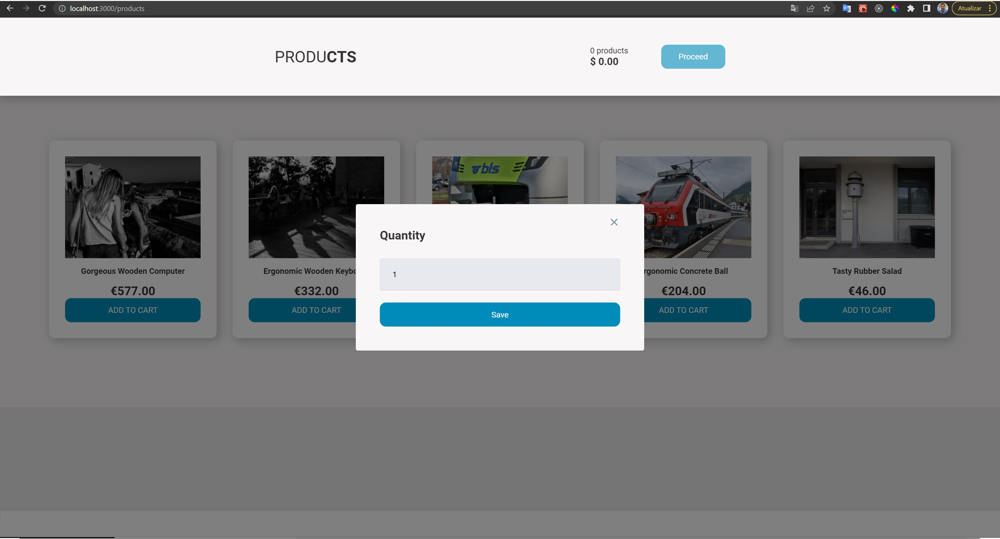
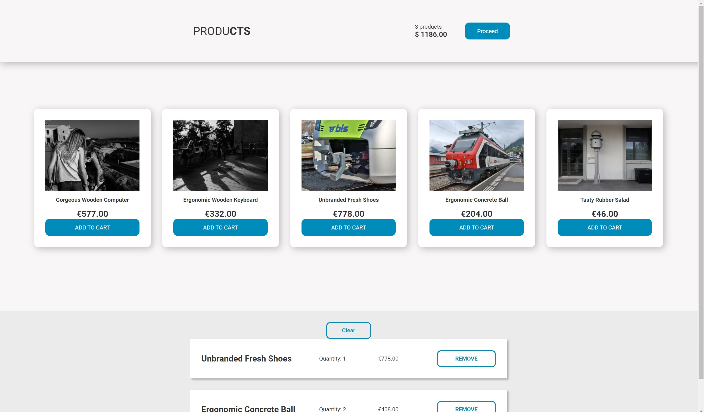
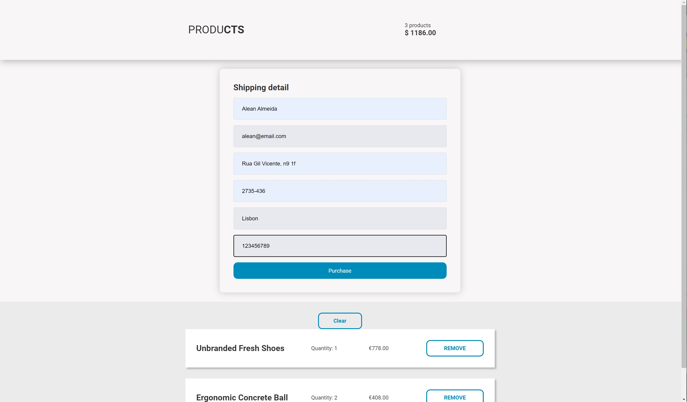
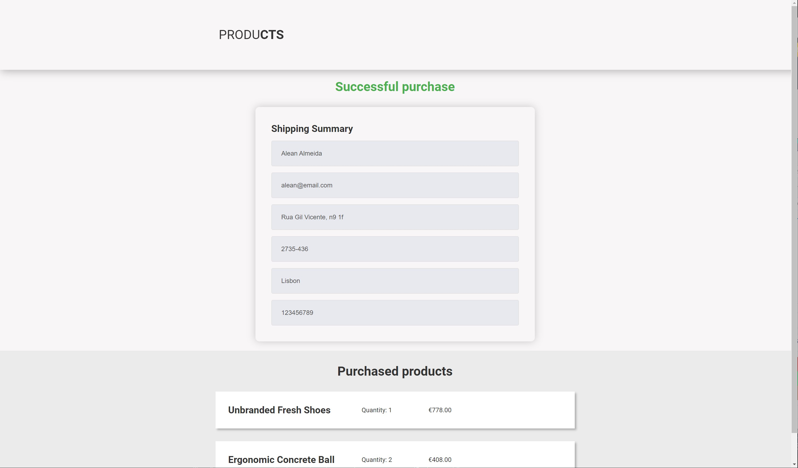
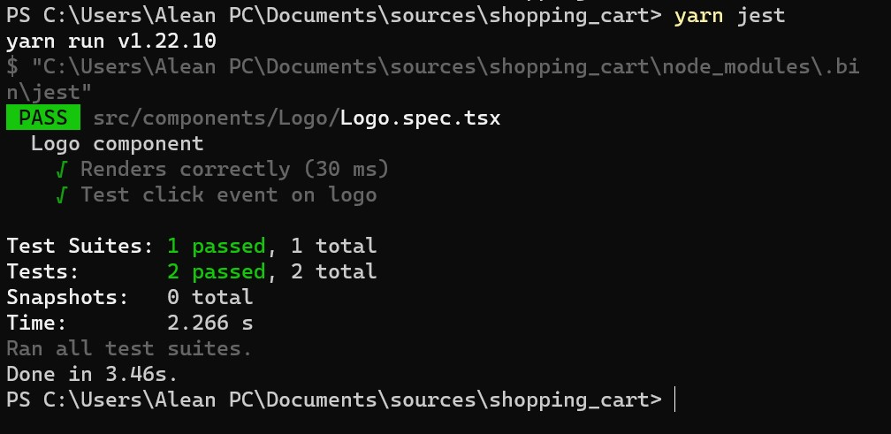

## Summary

Shopping cart application

What was done:

- Product list and selection

- Checkout page

- Success page

What could be improved:

- More tests

- More SEO techniques

- Code refactoring

- UI/UX improv

## How to

- Run development

Make sure the Node is up to date
-- yarn

-- yarn dev

- Run tests

--yarn jest

## Preview

# Tools

- Next.js
- Typescript
- Axios - Fetch Library
- React Query - for data synchronization
- Styled components
- Jest
- React modal
- Miraje JS
- Faker
- Next images
